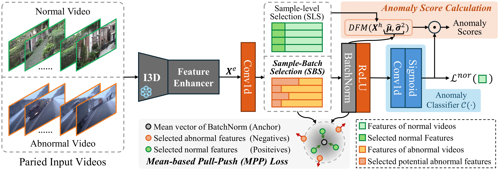

# BN-WVAD
The official implementation of "[BatchNorm-based Weakly Supervised Video Anomaly Detection](https://arxiv.org/abs/2311.15367)".

## Abstract
In weakly supervised video anomaly detection (WVAD),where only video-level labels are provided denoting thepresence or absence of abnormal events, the primary challenge arises from the inherent ambiguity in temporal annotations of abnormal occurrences. Inspired by the statistical insight that temporal features of abnormal events often exhibit outlier characteristics, we introduce the incorporation of BatchNorm into WVAD, resulting in a novel method termed BN-WVAD. Specifically, we treat the Divergence of Feature from Mean vector of BatchNorm as a reliable abnormality criterion to screen potential abnormal snippets. Moreover, a batch-level selection strategy is devised to filter more potential abnormal snippets in the video with more abnormal events occurring. In
particular, the proposed DFM criterion is also discriminative for anomaly recognition and more resilient to label noise. Integrated with the prediction of the anomaly classifier, our DFM contributes to the discrimination of abnormal events, thereby enhancing the tolerance to inevitable misselection.

## Enviroment
- Python 3.8.16
- PyTorch 2.0.0
- Torchvision 0.15.2
- cudatoolkit 11.7

## Dataset
**We use the extracted I3D features for UCF-Crime and XD-Violence datasets from the following works:**
> [**UCF-Crime 10-crop I3D features**](https://github.com/Roc-Ng/DeepMIL)
> 
> [**XD-Violence 5-crop I3D features**](https://roc-ng.github.io/XD-Violence/)

## Train
    python main.py --version train --root_dir data_root

## Inference
    python infer.py --model_path ./ckpts/xd_best_2022.pkl --root_dir data_root

## Result on XD-Violence
| Method |    AUC    |   AUC_sub   |     AP    |   AP_sub   |
| ------ | :-------: | :---------: | :-------: | :--------: |
| UR-DMU |   94.02   |    81.66    |   82.36   |    82.85   |
| BN-WVAD| **94.71** |  **83.59**  | **84.93** | **85.45**  |

## Thanks to

- [UR-DMU](https://github.com/henrryzh1/UR-DMU)
